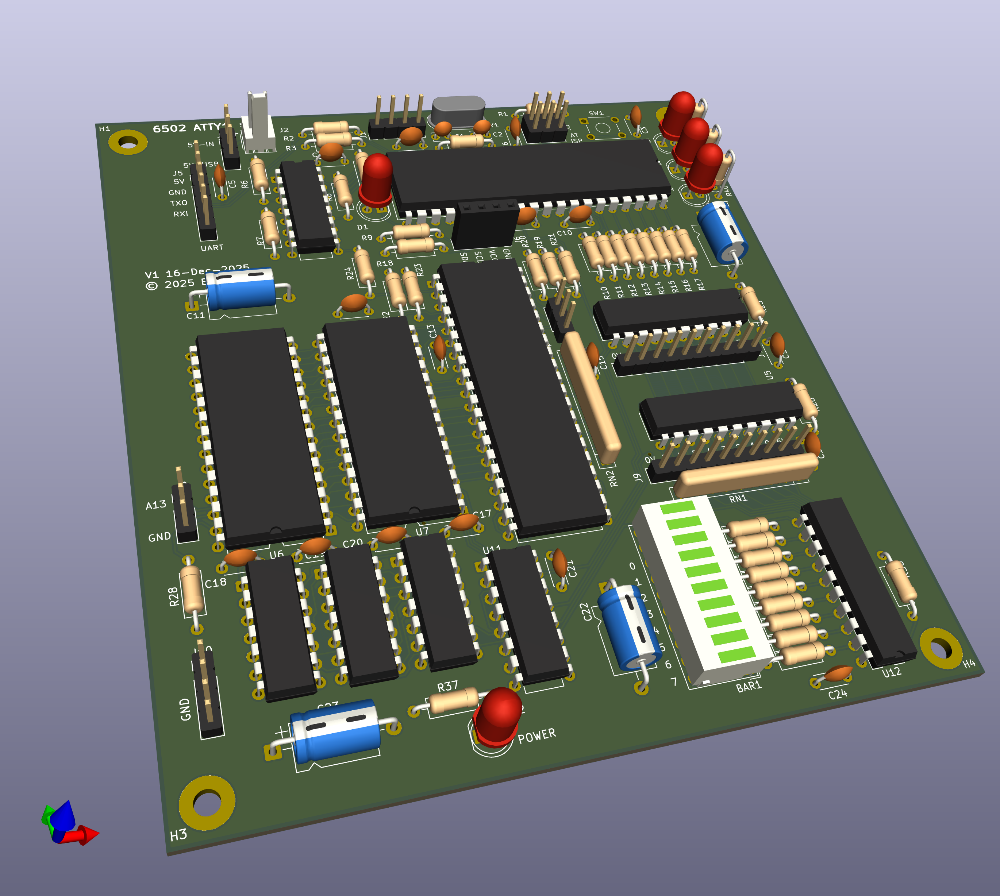

# 6502 Atty

A 6502 SBC with an ATMega as a contoller and monitor for the 6502.

This is an initial commit as PCBs are off for manufacture and not been tested. This includes the prototype firmware and the first cut of the firmware code.

The ATmega is probably the easiest MCU to get and program which is 5V tolerant. The 1284P is the current choice as the smaller memory versions are not much cheaper.

## Build notes for v1 rev1

- The 100UF capacitors are 16mm long so trying 47uF, layout change?

## PCB updates (v1 rev2)

- Added J12 to route ~WE signal to the PGM/~WE to allow SRAM
  - Also requires a R/!W signal gated with PHI2 high
  - Added R~{W}ph signal for ROM
  - This new signal could also drive RAM ~WE and connect ~CS to A15
- Connected ROM's VPP signal to GND, if using SRAM, ties A14 to GND
- U9C's pins 9 and 10 swapped for routing
- U11's E1/E2 pins swapped for easier routing
- Transcription error from prototype, ROM_ACC should be from AND not NAND gate
  - Swao U8C for one of U10 spare gates
- RDY line missing pull-up resistor
- 74LS573 replaced with 74LS574
  - 573 latches when Load is high, and our enable is low
  - 574 will load on rising edge of load pin, so should work
- Made PCB smaller, moved a few LEDs and things around to make this work

# Firmware

The firmware is currently in development. To build, you will need at-least avr-gcc and the relevant libraries and is currently only being tested on Linux (Debian). Once built, download to the ATMega using something like avrdude.

## Revision information

The original prototype version was built on a perfboard, and not release.

